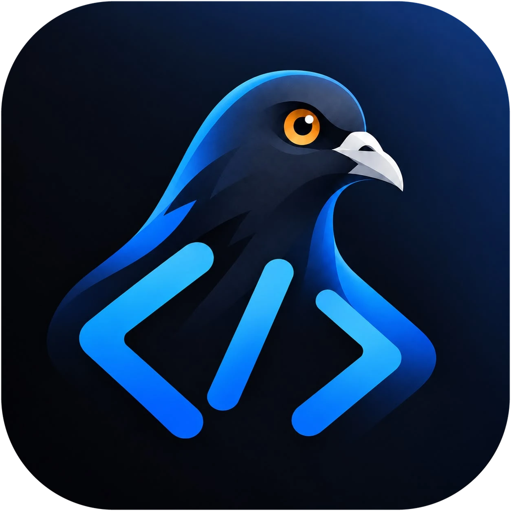
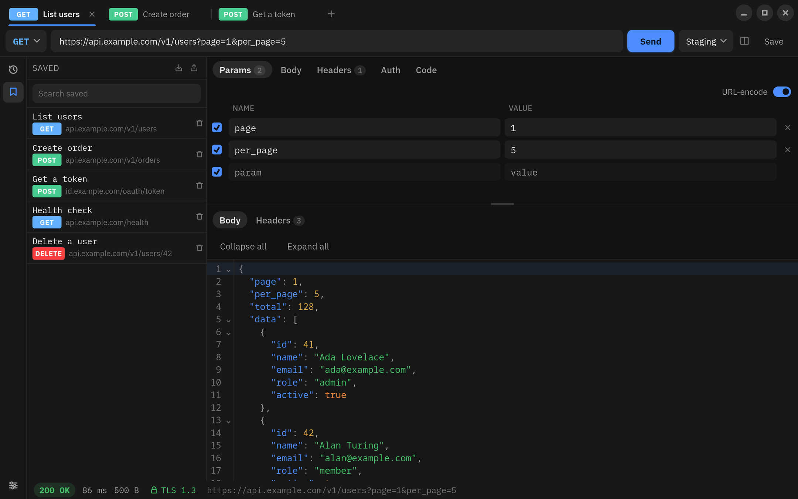
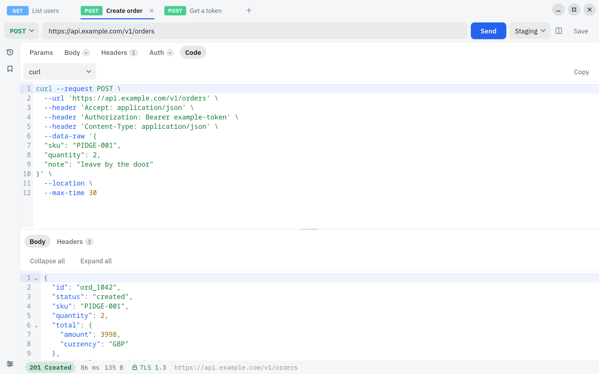
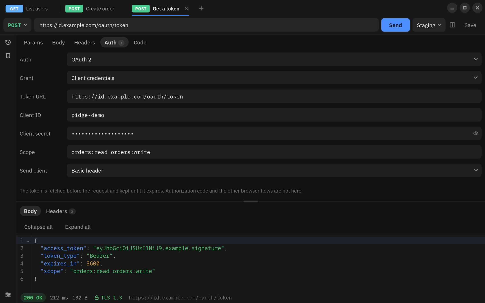
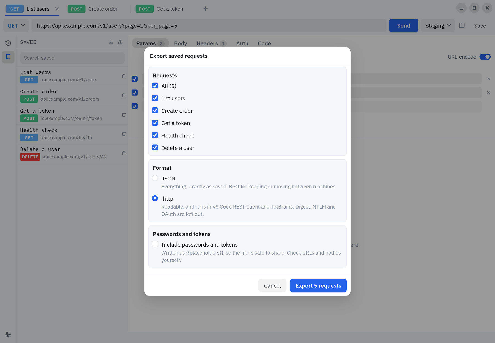

<p align="center">
  
</p>

<p align="center">
  <a href="https://github.com/Geevo/pidge/actions/workflows/ci.yml"></a>
  <a href="https://github.com/Geevo/pidge/releases/latest"></a>
  <a href="LICENSE"></a>
</p>

# pidge

A tiny, local-only HTTP client.

```
OPEN APP -> TYPE URL -> SEND REQUEST
```

That's the whole pitch. No login, no account, no cloud, no "create a workspace
to get started". It opens on a blank request with the cursor already in the URL
bar, and you never have to name or save anything to send it.

It exists because API clients kept turning into platforms. This one's just a
client. Everything it keeps is one JSON file in your own user directory, and the
only request it ever makes is the one you told it to.



## Get it

Grab a build from the [releases page](../../releases).

| Platform       | File                              | Notes                                                                 |
| -------------- | --------------------------------- | --------------------------------------------------------------------- |
| Windows 10/11  | `pidge-<version>-windows-x64.zip` | Unzip, run `pidge.exe`. Needs WebView2, which Windows 11 already has. |
| Linux          | `pidge-<version>-x86_64.AppImage` | Make it executable and run it. Nothing to install.                    |
| Debian, Ubuntu | `pidge_<version>_amd64.deb`       | `sudo apt install ./pidge_<version>_amd64.deb`                        |
| Fedora         | `pidge-<version>-1.x86_64.rpm`    | `sudo dnf install ./pidge-<version>-1.x86_64.rpm`                     |

Every build is native, so there is no .NET runtime to install. More on that
[below](#native-all-the-way-down). On Linux all three use the WebKitGTK 4.1
your desktop already has; the .deb and .rpm also put pidge in your app menu.

No macOS build yet. It should build there; nobody's tried.

Every release is built by GitHub Actions from the tagged source and comes with a
`SHA256SUMS`. To check that a download is what that build produced:

```bash
gh attestation verify pidge-<version>-x86_64.AppImage -R Geevo/pidge
```

Nothing's code-signed yet, so Windows SmartScreen will still give you a
talking-to the first time.

## Native, all the way down

pidge is C#, compiled ahead of time with NativeAOT. What you download is
machine code, not a .NET app that needs one installed first.

- **No runtime.** No .NET to install, no framework to keep patched, no
  launcher shim. Unzip it and run it.
- **One file.** The whole UI is embedded in it, and so is the native window
  host (and, on Windows, the WebView2 loader), so `pidge` _is_ the app and
  nothing sits beside it. The two native libraries unpack themselves into your
  local app data on first start.
- **Small.** The Windows download is about 5 MB, zipped.
- **No warm-up.** There's no JIT, so it's native code from the first
  instruction and it opens like it means it.
- **Nothing left to chance at runtime.** Every JSON type is source-generated
  and every library is marked AOT-compatible. Anything that would only break in
  the published build (reflection, dynamic code, trimming) is a build error
  instead.

The sidecar behind the VS Code extension is built the same way.

## Features

- **Every method**: `GET`, `POST`, `PUT`, `PATCH`, `DELETE`, `HEAD`, `OPTIONS`.
- **Request bodies**: JSON, plain text, form and multipart.
- **Readable responses**: highlighting and folding for JSON, HTML, XML, YAML,
  CSS and JavaScript. JSON is pretty-printed, and one click away when a server
  sends it as `text/plain`.
- **Params and headers**: tables with an on/off switch per row, and a
  URL-encoding toggle you can preview in the URL bar.
- **Auth**: bearer, basic, digest, NTLM, API key, OAuth 1 and OAuth 2. A header
  you set yourself takes priority.
- **Environments**: `{{variables}}`, so one request works against staging and
  prod.
- **Certificate details**: click the padlock to see the server's certificate.
  Expired and self-signed ones are flagged.
- **Custom CAs and client certificates**, on top of your system's certificate
  store.
- **Tabs, history and saved requests.**
- **Themes**: light and dark, with syntax colours from VS Code, Atom One or
  GitHub.
- **Keyboard shortcuts** for the everyday stuff (see [below](#keyboard)).
- **Text size** from 90% to 150%, scaling the whole window, not just the text.

### Copy as code



Turn any request into curl, PowerShell, Python, C#, Rust, Node.js, Go, Java, PHP
or Zig, picking the library where a language has more than one. Snippets are
built from what would actually be sent: variables filled in, query in the URL,
your timeout, redirect and certificate settings included. Anything a snippet
can't do, like an OAuth 1 signature, is called out in a comment.

### Masked and encrypted secrets



Passwords, tokens and client secrets are hidden until you press the eye, so
they stay off screen shares. On disk they're encrypted with a key your operating
system protects (DPAPI on Windows, your keyring or `systemd-creds` on Linux),
with no password prompts. Details in [docs/storage.md](docs/storage.md#secrets).

### Import and export



Export saved requests as JSON (everything, for moving machines) or as a `.http`
file for VS Code's REST Client and JetBrains. Passwords and tokens become
`{{placeholders}}` unless you include them, so exports are safe to share. Import
reads either, or `.http` files from REST Client and JetBrains, and lists any
variables you still need to define.

## What it won't do

Accounts, sync, sharing through somebody's cloud, dashboards, telemetry, update
pings, or anything that asks you to sign in.

## Keyboard

| Shortcut                             | Action            |
| ------------------------------------ | ----------------- |
| <kbd>Ctrl/Cmd</kbd>+<kbd>Enter</kbd> | Send              |
| <kbd>Ctrl/Cmd</kbd>+<kbd>L</kbd>     | Focus the URL     |
| <kbd>Ctrl/Cmd</kbd>+<kbd>N</kbd>     | New request       |
| <kbd>Ctrl/Cmd</kbd>+<kbd>W</kbd>     | Close the tab     |
| <kbd>Ctrl/Cmd</kbd>+<kbd>S</kbd>     | Save the request  |
| <kbd>Ctrl/Cmd</kbd>+<kbd>+</kbd>     | Bigger text       |
| <kbd>Ctrl/Cmd</kbd>+<kbd>-</kbd>     | Smaller text      |
| <kbd>Ctrl/Cmd</kbd>+<kbd>0</kbd>     | Text back to 100% |

<kbd>Enter</kbd> in the URL bar sends too.

## Where your stuff lives

One JSON file you can open and read, wherever your platform keeps app data:

| Platform | Path                                  |
| -------- | ------------------------------------- |
| Windows  | `%APPDATA%\pidge`                     |
| macOS    | `~/Library/Application Support/pidge` |
| Linux    | `~/.local/share/pidge`                |

Settings shows you the exact path. Delete the file and pidge starts fresh. If
it's ever unreadable, pidge keeps the broken one next to the new one rather
than binning it. Coming from back when it was called API Client? Your old
folder gets moved over on first launch.

## Build it yourself

You'll need the [.NET 10 SDK](https://dotnet.microsoft.com/download),
[Node](https://nodejs.org) 20+ and [pnpm](https://pnpm.io) 10+. On Linux the
window needs GTK 3 and WebKitGTK 4.1, and a native build needs clang. On Fedora
that's:

```bash
sudo dnf install gtk3-devel webkit2gtk4.1-devel clang zlib-devel
```

Then:

```bash
pnpm install
pnpm dev:desktop     # the app, with hot reload
```

To build what the releases ship:

```bash
pnpm build:desktop   # lands in artifacts/desktop/<runtime>/
```

That's a native (ahead-of-time compiled) build, which only targets the
operating system it runs on. [docs/packaging.md](docs/packaging.md) has the
details.

## In VS Code

Each request opens as a VS Code editor tab, with history and saved requests in
the side bar, talking to the same engine through a sidecar process. The colours
follow the editor's theme. It's not on the Marketplace yet; each release has a
`pidge-vscode-<version>-<platform>.vsix` for Linux and Windows instead, which
**Extensions: Install from VSIX...** takes. `pnpm dev:vscode` watches it.

## Working on it

```bash
pnpm lint && pnpm typecheck && pnpm test && pnpm format:check
dotnet format Pidge.slnx --verify-no-changes
dotnet build Pidge.slnx -warnaserror
dotnet test Pidge.slnx
```

C# does the HTTP and React is the control panel. There's no second HTTP
implementation: the UI can't touch the network by itself.

```
src/       Core, HttpEngine, Variables, Codegen, Storage, Session, Protocol,
           Sidecar, Desktop (the Photino window)
tests/     one test project per library, plus TestServer
apps/      desktop (the web bundle the window loads), vscode (extension host + webview)
packages/  ui — the React app both frontends mount
```

- [Architecture](docs/architecture.md): how the pieces fit, and why
- [Development](docs/development.md): the day-to-day workflow
- [Packaging](docs/packaging.md): builds, installers, icons
- [Storage and migrations](docs/storage.md)
- [Sidecar protocol](docs/protocol.md)

## Privacy

No analytics, no telemetry, no remote config, no update check, no web fonts.
Secret header values (`Authorization`, `Cookie`, `X-API-Key` and friends) never
end up in a log, and saved secrets are encrypted as described above.

## Licence

MIT; see [LICENSE](LICENSE). The bundled IBM Plex fonts are SIL Open Font
License 1.1; see [THIRD-PARTY-LICENSES.md](THIRD-PARTY-LICENSES.md).

## Credits

Co-created by [MJQ7](https://github.com/MJQ7).
